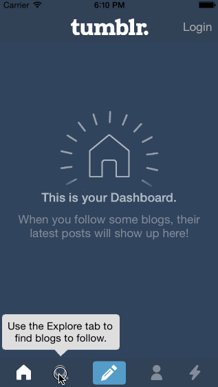

# Project 5: Tumblr

The purpose of this homework is to leverage animations and gestures to create custom navigation. We're going to use the techniques from this week to implement some interactions in Tumblr.

Time Spent: 5 hours

Completed User Stories:
* [x]	Tapping on Home, Search, Account, or Trending should show the respective screen and highlight the tab bar button.
* [x]	Compose button should modally present the compose screen.
* [x]	Optional: Compose screen is faded in while the buttons animate in.
* [x]	Optional: Login button should show animate the login form over the view controller.
* [x]	Optional: Discover bubble should bob up and down unless the SearchViewController is tapped.

Notes:

Walkthrough of all user stories:

GIF created with [LiceCap](http://www.cockos.com/licecap/).
